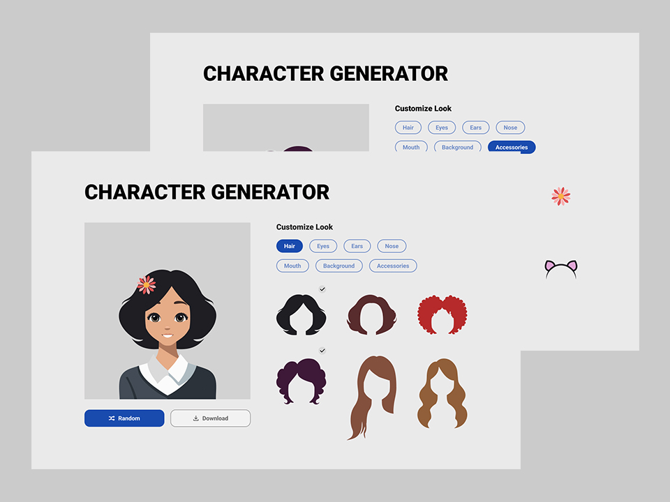

# 🎨 Character Customizer

Interactive web application to create and customize your own character using layered images and a background color picker.



---

## ✨ Description

**Character Customizer** is a fun tool that allows users to personalize a character by selecting different attributes like hairstyles, eyes, ears, noses, mouths, and accessories, along with choosing a custom background color using a **color picker**.  

The system supports:
- Real-time customization.
- Random character generation.
- Quick reset (Empty).
- Dynamic background color changes.
- Layered composition for stacking elements.

---

## 🚀 Features

- 🎨 **Background color picker** with instant application.
- 🖼 **Independent layers** for each category (eyes, hair, ears, nose, mouth, accessories).
- 🎲 **"Random" button** to generate a unique character combination.
- ♻ **"Empty" button** to reset the character to its base state while keeping the background color.
- 📱 **Responsive interface** with a clean and modern design.
- 🧩 **Modular structure** for easy event and state management.

---

## 📚 Tech Stack

- **HTML5** – Structure and semantic markup.
- **Tailwind CSS** – Modern utility-first CSS framework.
- **Vanilla JavaScript** – For dynamic DOM manipulation.
- **Organized Assets** – Stored in `/assets/character-images-left-side/`.

---
## 🎯 What You'll Learn from This Project

- ** 🛠 Dynamic DOM manipulation for real-time updates. **

- **⚡ Event handling & state management for UI customization. **

- ** 📂 Asset organization by categories and dynamic path loading. **

- ** 🎨 Using color input elements for direct user interaction. **

- ** 🧩 Best practices in modular JavaScript for clean and maintainable code. **

## 🛠 Installation & Usage
– `git clone https://github.com/username/character-customizer.git`

## 📋 Project Structure

```plaintext
project-root/
│── index.html
│── index.js
│── style.css
│── assets/
│   └── character-images-left-side/
│       ├── eyes/
│       ├── hair/
│       ├── ears/
│       ├── nose/
│       ├── mouth/
│       ├── accessories/
│       └── default/

